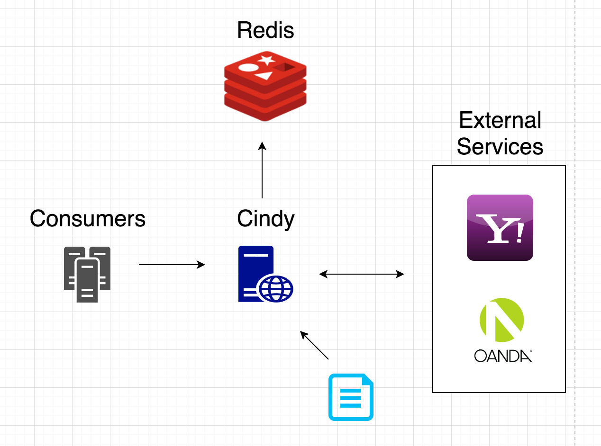

# Forex

Please refer diagram:

External service provides currency rates via API which is consumed by application/service *Cindy*
External service might support push updates what could be useful when the most recent rates are required
There are might be a few external services. Called in priority in case of any failure (ie: external service is down)

When no external services are available or no update of rates happened in X period of time - *Cindy* escalates  the issue to humans
*Cindy* also supports upload of currency rates from file to cover situation when no external services are available
*Cindy* validates new (received) rates with recent rates to see any anomaly difference which should be escalated to humans
*Cindy* uploads rates to fast in-memory database (ie Redis)

*Cindy* hides specific database and provides unified contract (API)
Also *Cindy* can do some fallback to previous rates in case fresh ones are no uploaded - issue is escalated to humans as well.
